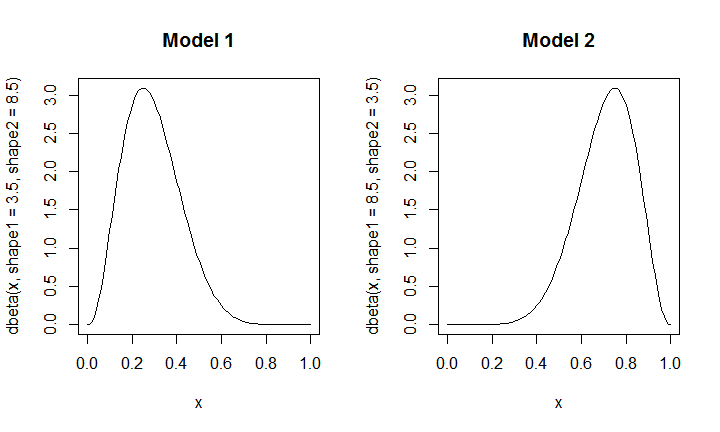
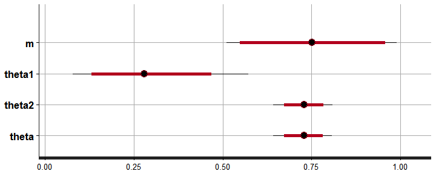

# Doing Bayesian Data Analysis Ch 10

## Bayesian model comparison

> Bayesian model comparison is really just a case of Bayesian parameter 
estimation applied to a hierarchical model in which the top-level parameter is 
an index for the models. 

## Bayesian model comparison

Before, we estimated our model by finding the posterior probability of parameter
$\theta$ by using Bayes theorem:

$$
p(\theta|D) = \frac{p(D|\theta)p(\theta)}{p(D)}
$$

We do model comparison in the same framework by considering $\theta$ alongside
model index parameter $m$:

$$
p(\theta,m|D) = \frac{p(D|\theta,m)p(\theta,m)}{p(D)}
$$

## Bayesian model comparison

We can factor out the joint prior on $\theta$ and $m$ by using the definition of
condition probability[1] 

$$
p(\theta,m|D) = 
  \frac{p(D|\theta,m)p(\theta,m)}{p(D)} = 
  \frac{p(D|\theta,m)p(\theta|m)p(m)}{p(D)}
$$

Now we have priors for $\theta$ associated with models $m$, $p(\theta|m)$, and a 
prior on $m$, $p(m)$. 

This gives us a hierarchical model, which contains the models we want to 
compare.

[1] $p(B|A) = p(A,B)/p(A)$, or $p(A,B) = p(B|A)p(A)$

## Probability of a model

Say we have models 1 and 2. If we estimate this hierarchical model of models 
using MCMC, the chain will jump between the two models -- $m$ will take on 
values 1 and 2 -- according to their posterior probability, which tells us which 
model is more likely. 

## Probability of a model

We can estimate the probability of a given model by marginalizing 
(summing/integrating) over $\theta$[1]:

$$
p(m|D) = \frac{p(D|m)p(m)}{p(D)}
$$

[1] $p(D|m) = \int_{\theta}p(D|\theta,m)p(\theta|m)d\theta$

## Comparing models: Bayes factors

We can use this to compare two models by looking at the ratio:

$$
\frac{p(m=1|D)}{p(m=2|D)} = \frac{p(D|m=1)p(m=1)/p(D)}{p(D|m=2)p(m=2)/p(D)}
$$

The Bayes factor is the ratio of the probabilities of the data in models 1 and 
2.

$$
BF = \frac{p(D|m=1)}{p(D|m=2)}
$$

Note that these probabilities are marginalized over the allowable parameter 
values in models 1 and 2; they are not just probabilities of the data at a 
single parameter value (or set of values), as in a likelihood ratio.

## Bayes factors

Kruschke: "One convention for converting the magnitude of the BF to a discrete 
decision about the models is that there is "substantial" evidence for model m=1 
when the BF exceeds 3.0 and, equivalently, "substantial" evidence for model m=2 
when the BF is less than 1/3."

## Gelman/Rubin on Bayes factors

Andrew Gelman and Donald Rubin [disagree with Bayes factors and model 
selection](http://www.stat.columbia.edu/~gelman/research/published/avoiding.pdf): 
"We believe model selection to be relatively unimportant compared to the task of 
constructing realistic models that agree with both theory and data. In most 
cases we would prefer to fit a complicated model [...] and then summarize it 
appropriately to answer substantive questions of interest"

## Implementation

Basic idea: sample $m$, then sample $\theta$ for the corresponding model

Note: Stan does not support discrete parameters

```
transformed parameters {
  real<lower=0,upper=1> theta;
  theta <- if_else(m < 0.5, theta1, theta2);
}
model {
  m ~ uniform(0, 1);
  theta1 ~ beta(3.5, 8.5);
  theta2 ~ beta(8.5, 3.5);
  y ~ bernoulli(theta);
}
```

## Implementation {.smaller}

Set up model


```r
model_string <- "
data {
  int<lower=0> N;
  int<lower=0,upper=1> y[N];
}
parameters {
  real<lower=0,upper=1> m;
  real<lower=0,upper=1> theta1;
  real<lower=0,upper=1> theta2;
}
transformed parameters {
  real<lower=0,upper=1> theta;
  theta <- if_else(m < 0.5, theta1, theta2);
}
model {
  m ~ uniform(0, 1);
  theta1 ~ beta(3.5, 8.5);
  theta2 ~ beta(8.5, 3.5);
  y ~ bernoulli(theta);
}
"
```

## Implementation {.smaller}


```r
set.seed(1)
y <- rbinom(100, size = 1, prob = 0.75)
stan_data <- list(N = length(y), y = y)
fit <- stan(model_code = model_string, data = stan_data)
```


```r
fit
```

```
## Inference for Stan model: 3c1f12f899c86c901635ee95d36138fe.
## 4 chains, each with iter=2000; warmup=1000; thin=1; 
## post-warmup draws per chain=1000, total post-warmup draws=4000.
## 
##          mean se_mean   sd   2.5%    25%    50%    75%  97.5% n_eff Rhat
## m        0.75    0.00 0.15   0.51   0.62   0.75   0.88   0.99   935 1.00
## theta1   0.29    0.00 0.13   0.08   0.19   0.28   0.37   0.57  1273 1.00
## theta2   0.73    0.00 0.04   0.64   0.70   0.73   0.76   0.81  1051 1.00
## theta    0.73    0.00 0.04   0.64   0.70   0.73   0.76   0.81  1079 1.00
## lp__   -75.94    0.05 1.41 -79.71 -76.59 -75.58 -74.91 -74.32   804 1.01
## 
## Samples were drawn using NUTS(diag_e) at Sun Feb 28 22:03:11 2016.
## For each parameter, n_eff is a crude measure of effective sample size,
## and Rhat is the potential scale reduction factor on split chains (at 
## convergence, Rhat=1).
```

## Priors {.smaller}


```r
par(mfcol = c(1, 2))
curve(dbeta(x, shape1 = 3.5, shape2 = 8.5), 0, 1, main = "Model 1")
curve(dbeta(x, shape1 = 8.5, shape2 = 3.5), 0, 1, main = "Model 2")
```



## Results


```r
plot(fit)
```

```
## ci_level: 0.8 (80% intervals)
```

```
## outer_level: 0.95 (95% intervals)
```



## Autocorrelation

When you use MCMC on a model set up like this, you can end up with a lot of 
autocorrelation in your chain and low effective sample size.

This is because when model index is on a given model, the other model parameter
continues to sample wherever it is, and the chain is less likely to jump to it 
because it doesn't fit the data well (yet).

## Pseudopriors

You can improve how fast your model converges by using pseudopriors. 
Pseudopriors are priors for parameters that take effect only when another 
model is currently 'active'.

e.g. a prior for $\theta$ in model 1 while model 2 is active.

Kruschke's advice for picking pseudopriors is to run your ordinary model, find 
the posterior mode, and use that as your pseudoprior.

## Model averaging

"if the hierarchical structure really expresses our prior beliefs, then the most complete prediction of future data takes into account all the models, weighted by their posterior credibilities."

"we take a weighted average across the models, with the weights being the posterior probabilities of the models.""

## Model complexity

"Bayesian model comparison compensates for model complexity by the fact that 
each model must have a prior distribution over its parameters" 

"more complex models must dilute their prior distributions over larger parameter
spaces than simpler models."

"even if a complex model has some particular combination of parameter values 
that fit the data well, the prior probability of that particular combination 
must be small because the prior is spread thinly over the broad parameter 
space."

## Sensitivity to priors

"Bayesian model comparison involves marginalizing across the prior distribution 
in each model. Therefore, the posterior probabilities of the models, and the 
Bayes factors, can be extremely sensitive to the choice of prior distribution."

"many mathematical statisticians recommend a different form of prior to make it 
uninformative according to a particular mathematical criterion. The recommended 
prior is the so-called Haldane prior, which uses shape constants that are very 
close to zero, such as a = b = 0.01."
