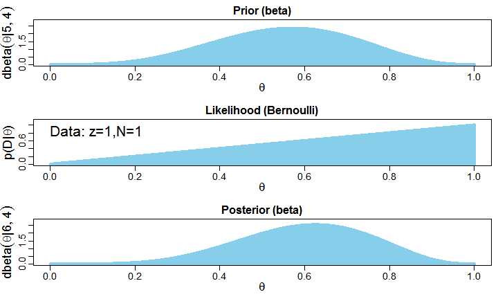
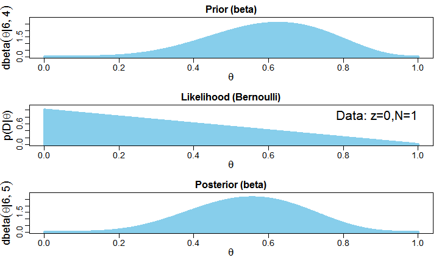
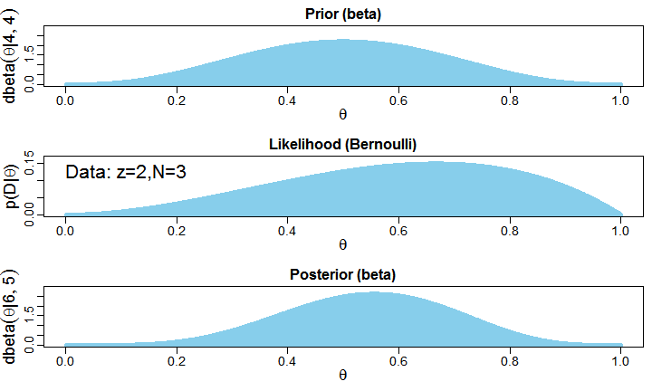
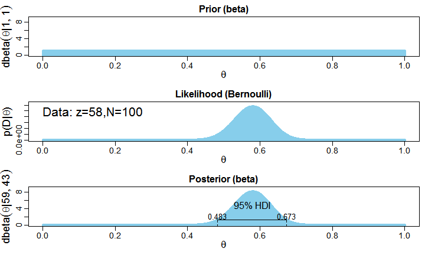
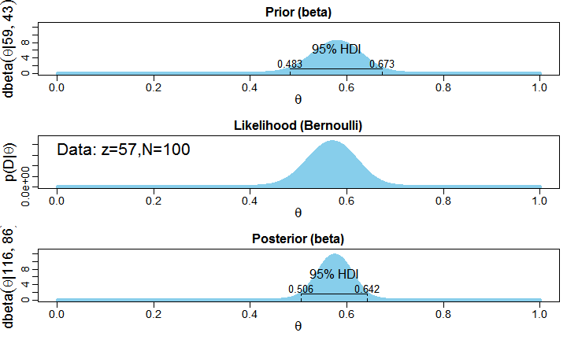
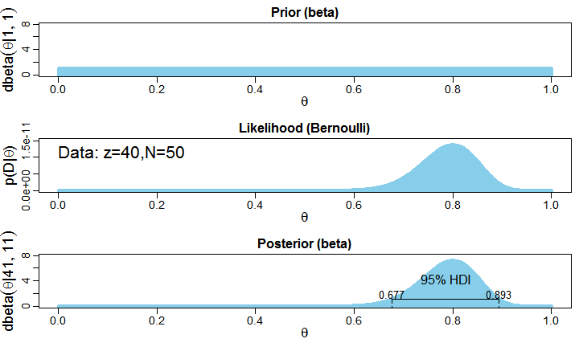
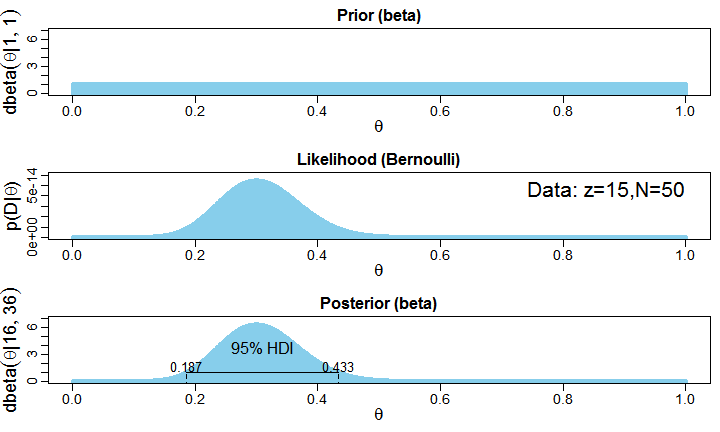
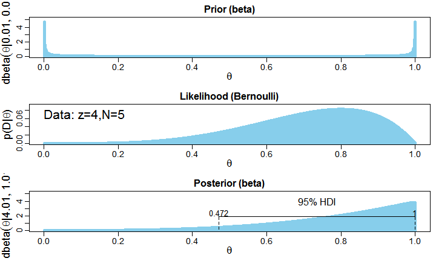
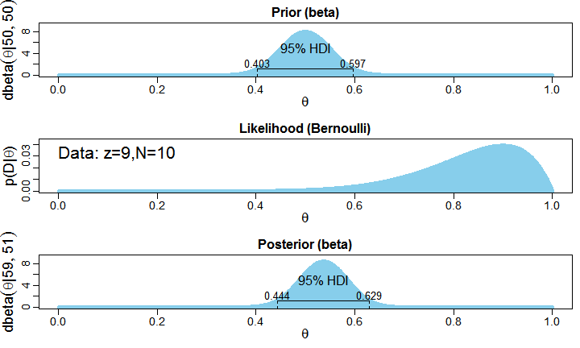
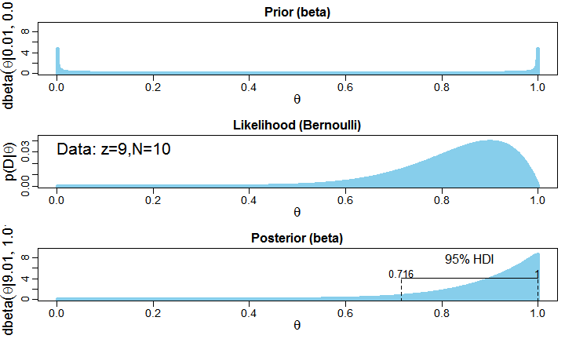

# Chapter 6: Inferring a Binomial Probability via Exact Mathematical Analysis

# Notes

## Bernoulli Probability

The Bernoulli distribution is the probability distribution over an outcome of two discrete values.

*Bernoulli probability distribution:*
$$p(y|\theta) = \theta ^y(1 - \theta)^{(1 - y)}$$


## Bernoulli Likelihood

We can either try to think of estimating $\theta$, the probability of any one outcome being 1 v. 0, or we can think of the data ${y_i}$ as fixed and the estimation being the likelihood of observing $(1,1,1,0)$ (for example) given a value of $\theta$.

*Bernoulli likelihood function:*
$$p({y_i}|\theta) = \theta ^z(1 - \theta)^{(N - z)}$$

Note, estimating the likelihood of the observed data != probability of the data (the likelihood does not integrate to 1).


## Mathematical tractability

Deriving the mathematical form of the posterior credibility of parameter values requires mathematically tractable descriptions of the priors.

1. If the product of $p(y|\theta)$ and $p(\theta)$ (Bayes's Rule numerator) results in a function of the same form as $p(\theta)$

2. $\int d\theta p(y|\theta) p(\theta)$ (Bayes's Rule denominator) should be solveable analytically.


## Beta distribution

Prior beliefs that pair in a mathematically tractable way to the Bernoulli distribution can be expressed as the *beta distribution*, a function of $\theta$, where the denominator is the normalizer, the *beta function*.

$$p(\theta |a,b) = \frac{\theta^{(a - 1)}(1 - \theta)^{(b - 1)}}{B(a,b)}$$

```r
dbeta(theta, a, b)
```

$$B(a,b) = \int_0^1 d\theta  \theta^{(a - 1)}(1 - \theta)^{(b - 1)}$$

```r
beta(a, b)
```


## Beta distribution, cont.

$a$ and $b$ are the shape parameters of the beta distribution. In terms of observed data, $a + b = n$, so that an observed dataset of $(0,1)$ would be $a:1 + b:1 = n:2$.

Mean / central tendency:
$$\mu = \frac{a}{a + b}$$

Mode / spread:
$$\omega = \frac{a - 1}{a + b - 2}$$


## Beta distribution, cont.

The spread of the distribution is expressed as its concentration, $\kappa$.

*a* and *b* can be expressed in terms of mean, mode, and concentration.

$a = \mu\kappa$  and  $b = (1 - \mu)\kappa$

$a = \omega(\kappa - 2) + 1$  and  $b = (1 - \omega)(\kappa - 2) + 1$ for $\kappa > 2$

Larger $\kappa$ means greater confidence in our prior.


## Prior to posterior

If the prior is a beta distribution, the posterior will be too.

$$p(\theta |z, N) = \frac{\theta ^{(z-a+1)}(1 - \theta)^{(N - z + b - 1)}}{B(z +a, N - z + b)}$$

$$\mu_{posterior} = \frac{z + a}{N + a + b}$$

Where $z$ is the number of affirmative results and $N$ is the total number of observations.

Our choice of prior $n$ (where $n = a + b$) should represent the size of the new data set that would sway our proir toward the data proportion.

## Non-beta priors

Not all priors can be expressed by the beta distribution. For example, the probability that a coin will come up heads when we know the coin is biased but we don't know whether it's biased in favor of heads or of tails.

Only simple likelihood functions have conjugate (mathematically tractable) priors. Not all prior knowledge can be expressed in the mathematical form of a conjugate prior.


# Exercises


## Setup


```r
setwd("~\\dbda")
r <- getOption("repos")
r["CRAN"] <- "http://watson.nci.nih.gov/cran_mirror/"
options(repos = r)
source("DBDA2Eprograms\\DBDA2E-utilities.R")
```

```
## 
## *********************************************************************
## Kruschke, J. K. (2015). Doing Bayesian Data Analysis, Second Edition:
## A Tutorial with R, JAGS, and Stan. Academic Press / Elsevier.
## *********************************************************************
```

```
## Loading required package: coda
```

```r
source("DBDA2Eprograms\\BernBeta.R")
```

## 6.1.a


```r
BernBeta(priorBetaAB = c(4, 4), Data = 1)
```

 

```
## [1] 5 4
```

## 6.1.b


```r
BernBeta(priorBetaAB = c(5, 4), Data = 1)
```

 

```
## [1] 6 4
```

## 6.1.c


```r
BernBeta(priorBetaAB = c(6, 4), Data = 0)
```

 

```
## [1] 6 5
```

## 6.1.d


```r
BernBeta(priorBetaAB = c(4, 4), Data = c(0, 1, 1))
```

 

```
## [1] 6 5
```

## 6.2.a


```r
BernBeta(priorBetaAB = c(1, 1),
         Data = c(rep(1, 58), rep(0, 100 - 58)),
         showHDI = TRUE)
```

 

```
## [1] 59 43
```

## 6.2.b


```r
BernBeta(priorBetaAB = c(59, 43),
         Data = c(rep(1, 57), rep(0, 100 - 57)),
         showHDI = TRUE)
```

 

```
## [1] 116  86
```

## 6.3


```r
BernBeta(priorBetaAB = c(1, 1),
         Data = c(rep(1, 40), rep(0, 10)),
         showHDI = TRUE)
```

 

```
## [1] 41 11
```

## 6.3, cont.


```r
BernBeta(priorBetaAB = c(1, 1),
         Data = c(rep(1, 15), rep(0, 35)),
         showHDI = TRUE)
```

 

```
## [1] 16 36
```

## 6.4


```r
BernBeta(priorBetaAB = c(.01, .01),
         Data = c(1, 1, 1, 1, 0),
         showHDI = TRUE)
```

 

```
## [1] 4.01 1.01
```

## 6.5.a


```r
BernBeta(priorBetaAB = c(50, 50),
         Data = c(rep(1, 9), 0),
         showHDI = TRUE)
```

 

```
## [1] 59 51
```

## 6.5.a


```r
BernBeta(priorBetaAB = c(.01, .01),
         Data = c(rep(1, 9), 0),
         showHDI = TRUE)
```

 

```
## [1] 9.01 1.01
```
