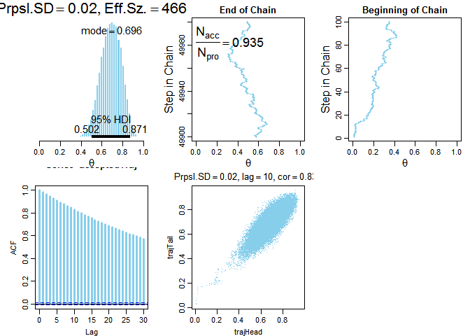
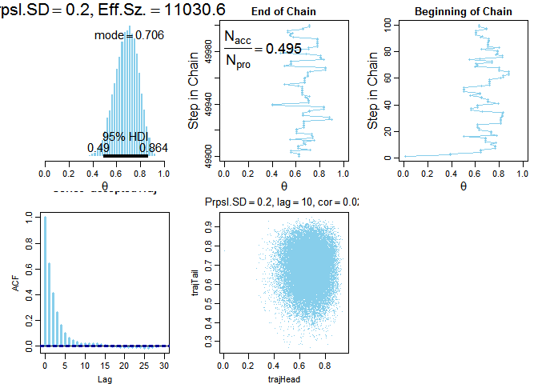
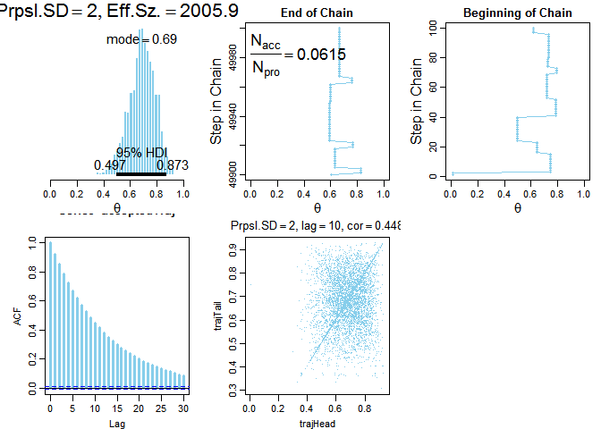
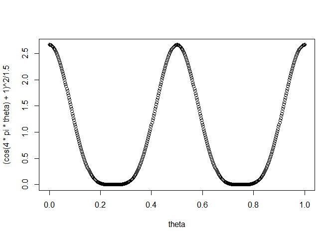
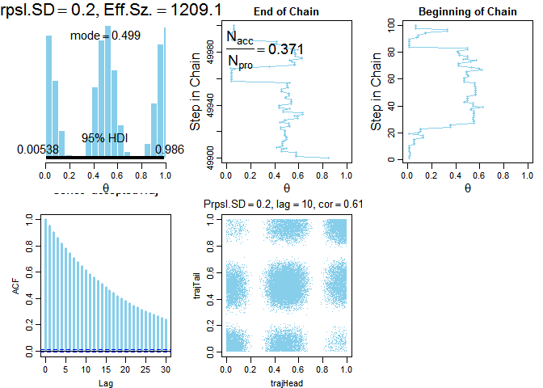
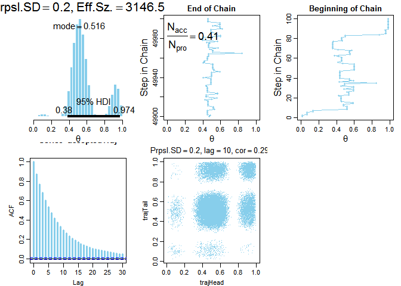
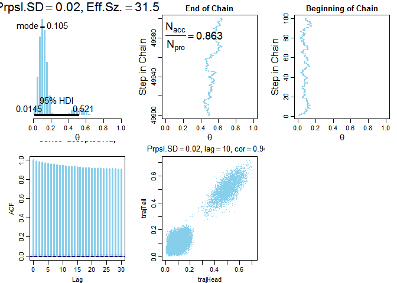
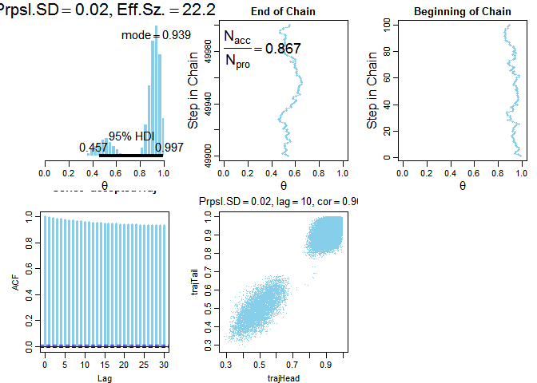

# Doing Bayesian Data Analysis Ch. 7

# Load libraries, functions, etc.


```r
source("../DBDA2Eprograms/DBDA2E-utilities.R")
```

```
## 
## *********************************************************************
## Kruschke, J. K. (2015). Doing Bayesian Data Analysis, Second Edition:
## A Tutorial with R, JAGS, and Stan. Academic Press / Elsevier.
## *********************************************************************
```

```
## Loading required package: coda
```

```r
# Specify the data, to be used in the likelihood function.
myData = c(rep(0,6),rep(1,14))

# Define the Bernoulli likelihood function, p(D|theta).
# The argument theta could be a vector, not just a scalar.
likelihood = function( theta , data ) {
  z = sum( data )
  N = length( data )
  pDataGivenTheta = theta^z * (1-theta)^(N-z)
  # The theta values passed into this function are generated at random,
  # and therefore might be inadvertently greater than 1 or less than 0.
  # The likelihood for theta > 1 or for theta < 0 is zero:
  pDataGivenTheta[ theta > 1 | theta < 0 ] = 0
  return( pDataGivenTheta )
}

# Define the prior density function. 
prior = function( theta ) {
  pTheta = dbeta( theta , 1 , 1 )
  # The theta values passed into this function are generated at random,
  # and therefore might be inadvertently greater than 1 or less than 0.
  # The prior for theta > 1 or for theta < 0 is zero:
  pTheta[ theta > 1 | theta < 0 ] = 0
  return( pTheta )
}

# Define the relative probability of the target distribution, 
# as a function of vector theta. For our application, this
# target distribution is the unnormalized posterior distribution.
targetRelProb = function( theta , data ) {
  targetRelProb =  likelihood( theta , data ) * prior( theta )
  return( targetRelProb )
}

# Specify standard deviation of proposal distribution:
proposalSD = c(0.02,0.2,2.0)[2]

metropolis <- function(myData, proposalSD) {
  # Specify the length of the trajectory, i.e., the number of jumps to try:
  trajLength = 50000 # arbitrary large number
  # Initialize the vector that will store the results:
  trajectory = rep( 0 , trajLength )
  # Specify where to start the trajectory:
  trajectory[1] = 0.01 # arbitrary value
  # Specify the burn-in period:
  burnIn = ceiling( 0.0 * trajLength ) # arbitrary number, less than trajLength
  # Initialize accepted, rejected counters, just to monitor performance:
  nAccepted = 0
  nRejected = 0
  
  # Now generate the random walk. The 't' index is time or trial in the walk.
  # Specify seed to reproduce same random walk:
  # set.seed(47405)
  
  for ( t in 1:(trajLength-1) ) {
    currentPosition = trajectory[t]
    # Use the proposal distribution to generate a proposed jump.
    proposedJump = rnorm( 1 , mean=0 , sd=proposalSD )
    # Compute the probability of accepting the proposed jump.
    probAccept = min( 1,
                      targetRelProb( currentPosition + proposedJump , myData )
                      / targetRelProb( currentPosition , myData ) )
    # Generate a random uniform value from the interval [0,1] to
    # decide whether or not to accept the proposed jump.
    if ( runif(1) < probAccept ) {
      # accept the proposed jump
      trajectory[ t+1 ] = currentPosition + proposedJump
      # increment the accepted counter, just to monitor performance
      if ( t > burnIn ) { nAccepted = nAccepted + 1 }
    } else {
      # reject the proposed jump, stay at current position
      trajectory[ t+1 ] = currentPosition
      # increment the rejected counter, just to monitor performance
      if ( t > burnIn ) { nRejected = nRejected + 1 }
    }
  }
  
  # Extract the post-burnIn portion of the trajectory.
  acceptedTraj = trajectory[ (burnIn+1) : length(trajectory) ]
  
  list(trajectory = trajectory, 
       acceptedTraj = acceptedTraj, 
       proposalSD = proposalSD, 
       nAccepted = nAccepted, 
       nRejected = nRejected, 
       trajLength = trajLength, 
       burnIn = burnIn)
}

# test <- metropolis(myData, 0.2)

#-----------------------------------------------------------------------

# Display the chain.

# openGraph(width=4,height=8)
metropolisPlot <- function(x) {
  
  for (i in seq_along(x)) {
    assign(names(x)[i], x[[i]])
  }
  
  layout( matrix(1:6, nrow=2, byrow=TRUE) )
  par(mar=c(3,4,2,1),mgp=c(2,0.7,0))
  
  # Posterior histogram:
  paramInfo = plotPost( acceptedTraj , xlim=c(0,1) , xlab=bquote(theta) , 
                        cex.main=2.0 ,
                        main=bquote( list( "Prpsl.SD" == .(proposalSD) ,
                                           "Eff.Sz." == .(round(effectiveSize(acceptedTraj),1)) ) ) )
  
  # Trajectory, a.k.a. trace plot, end of chain:
  idxToPlot = (trajLength-100):trajLength
  plot( trajectory[idxToPlot] , idxToPlot , main="End of Chain" ,
        xlab=bquote(theta) , xlim=c(0,1) , ylab="Step in Chain" ,
        type="o" , pch=20 , col="skyblue" , cex.lab=1.5 )
  # Display proposal SD and acceptance ratio in the plot.
  text( 0.0 , trajLength , adj=c(0.0,1.1) , cex=1.75 ,
        labels = bquote( frac(N[acc],N[pro]) == 
                           .(signif( nAccepted/length(acceptedTraj) , 3 ))))
  
  # Trajectory, a.k.a. trace plot, beginning of chain:
  idxToPlot = 1:100
  plot( trajectory[idxToPlot] , idxToPlot , main="Beginning of Chain" ,
        xlab=bquote(theta) , xlim=c(0,1) , ylab="Step in Chain" ,
        type="o" , pch=20 , col="skyblue" , cex.lab=1.5 )
  # Indicate burn in limit (might not be visible if not in range):
  if ( burnIn > 0 ) {
    abline(h=burnIn,lty="dotted")
    text( 0.5 , burnIn+1 , "Burn In" , adj=c(0.5,1.1) )
  }
  
  acf( acceptedTraj , lag.max=30 , col="skyblue" , lwd=3 ) 
  Len = length( acceptedTraj ) 
  Lag = 10 
  trajHead = acceptedTraj[ 1 : (Len-Lag) ] 
  trajTail = acceptedTraj[ (1+Lag) : Len ] 
  plot(trajHead , 
       trajTail , 
       pch="." , 
       col="skyblue" , 
       main=bquote(list("Prpsl.SD" == .(proposalSD) , 
                        lag == .(Lag) , 
                        cor == .(round(cor(trajHead,trajTail),3)))) )
}
```

# Exercise 1 & 2

> Exercise 7.1. [Purpose: Experiment with the Metropolis algorithm as displayed in Figure 7.4.] Open the program named BernMetrop.R from the files
that accompany this book. The script implements a Metropolis algorithm for Figure 7.4 Midway through the script, you will find a line that specifies the SD of the proposal distribution:
proposalSD = c(0.02,0.2,2.0)[2]
The line may look strange but it's merely a vector of constants with an index at the end to specify which component should be used. Thus, it's a simple way of specifying three options and then selecting one option. Run the script three times, once with each option (i.e., once with [1], once with [2], and once with [3]). There is also a line that specifies the seed for the random number generator; comment it out so that you get a different trajectory than the ones shown in Figure 7.4. Notice at the end of the script that you can specify the format of the graphic file for saving the resulting graph. Include the graphs in your write-up and describe whether they show similar behavior as the corresponding trajectories in Figure 7.4. Be sure to discuss the ESS. 

> Exercise 7.2. [Purpose: To explore the autocorrelation function in Figure 7.12.] At the end of the script BernMetrop.R, add these lines:
openGraph(height=7,width=3.5) 
layout(matrix(1:2,nrow=2)) 
acf( acceptedTraj , lag.max=30 , col="skyblue" , lwd=3 ) 
Len = length( acceptedTraj ) 
Lag = 10 
trajHead = acceptedTraj[ 1 : (Len-Lag) ] 
trajTail = acceptedTraj[ (1+Lag) : Len ] 
plot( trajHead , trajTail , pch="." , col="skyblue" , main=bquote( list( "Prpsl.SD" == .(proposalSD) , lag == .(Lag) , cor == .(round(cor(trajHead,trajTail),3)))) )

> (A) Before each line, add a comment that explains what the line does. Include the commented code in your write-up. 

> (B) Repeat the previous exercise,with the lines above appended to the script. Include the resulting new graphs in your write-up. For each run, verify that the height of the ACF bar at the specified lag matches the correlation in the scatterplot. 

> (C) When the proposal distribution has SD=2,why does the scatterplot have a dense line of points on the diagonal? (Hint: Look at the trajectory.) 

---

## SD = 0.02


```r
metropolisPlot(metropolis(myData, 0.02))
```

 

---

## SD = 0.2


```r
metropolisPlot(metropolis(myData, 0.2))
```

 

---

## SD = 2


```r
metropolisPlot(metropolis(myData, 2))
```

 

---

# Exercise 3

> Exercise 7.3. [Purpose: Using a multimodal prior with the Metropolis algorithm, and seeing how chains can transition across modes or get stuck within them.] In this exercise, you will see that the Metropolis algorithm operates with multimodal distributions. 

> (A) Consider a prior distribution on coin bias that puts most credibility at 0.0, 0.5, and 1.0, which we will formulate as p(theta) = (cos(4*pi*theta)+1)2/1.5.

> (B) Make a plot of the prior. Hint: theta = seq(0,1,length=501); plot (theta , (cos(4*pi*theta)+1)^2/1.5 ) 


```r
theta = seq(0,1,length=501)
plot (theta , (cos(4*pi*theta)+1)^2/1.5 ) 
```

 

> (C) In the script BernMetrop.R, find the function definition that specifies the prior distribution. Inside that function definition, comment out the line that assigns a beta density to pTheta, and instead put in a trimodal prior like this:
#pTheta = dbeta( theta,1,1) pTheta = (cos(4*pi*theta)+1)^2/1.5
To have the Metropolis algorithm explore the prior, we give it empty data. Find the line in the script that specifies the data and set myData = c(). Run the script, using a proposal SD=0.2. Include the graphical output in your write-up. Does the histogram of the trajectory look like the graph of the previous part of the exercise? 


```r
body(prior)[[2]][[3]] <- substitute((cos(4*pi*theta)+1)^2/1.5)
prior
```

```
## function (theta) 
## {
##     pTheta = (cos(4 * pi * theta) + 1)^2/1.5
##     pTheta[theta > 1 | theta < 0] = 0
##     return(pTheta)
## }
```

```r
metropolisPlot(metropolis(c(), 0.2))
```

 

> (D) Repeat the previous part but now with myData = c(0,1,1). Include the graphical output in your write-up. Does the posterior distribution make sense? Explain why. 


```r
metropolisPlot(metropolis(c(0,1,1), 0.2))
```

 

> (E) Repeat the previous part but now with proposalSD=0.02. Include the graphical output in your write-up. Does the posterior distribution make sense? Explain why not; what has gone wrong? If we did not know from the previous part that this output was unrepresentative of the true posterior, how could we try to check? Hint: See next part. 


```r
metropolisPlot(metropolis(c(0,1,1), 0.02))
```

 

> (F) Repeat the previous part but now with the initial position at 0.99: trajectory[1] = 0.99. In conjunction with the previous part, what does this result tell us?


```r
body(metropolis)[[4]][[3]] <- 0.99
metropolisPlot(metropolis(c(0,1,1), 0.02))
```

 
