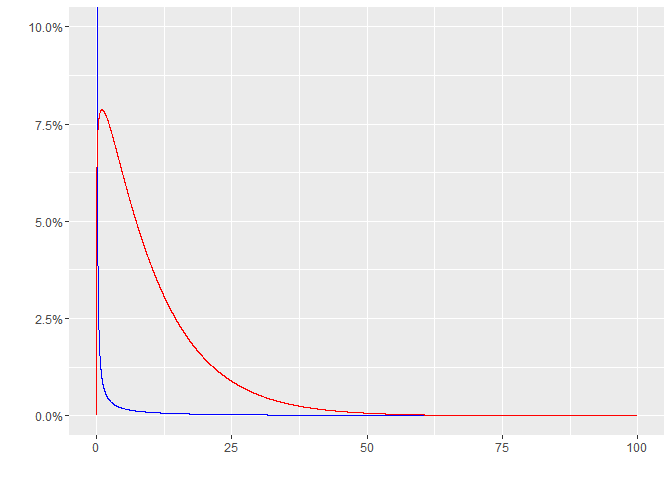
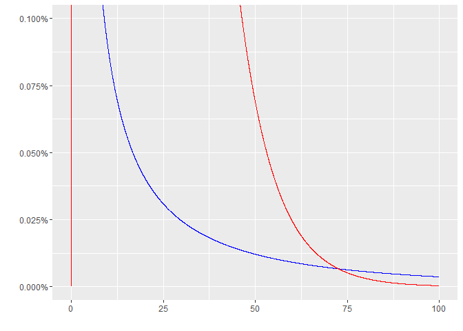
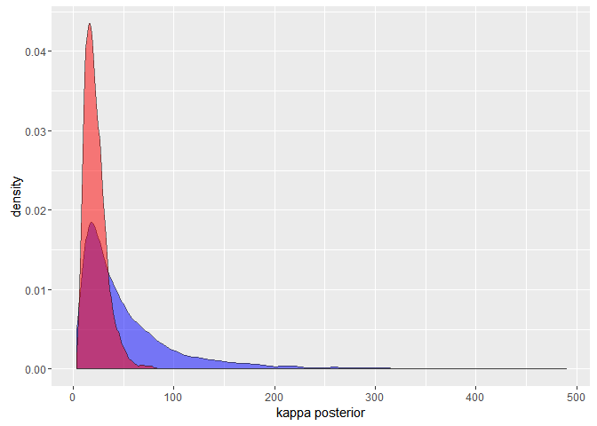
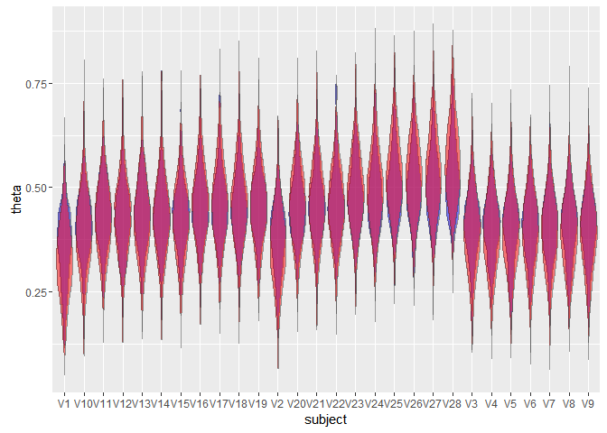
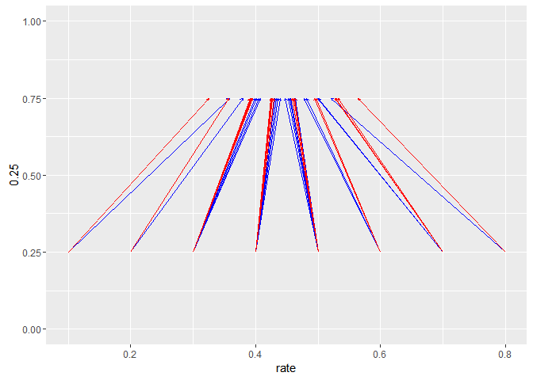
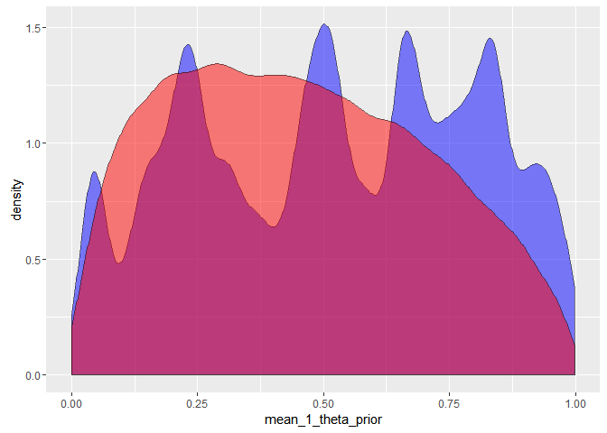
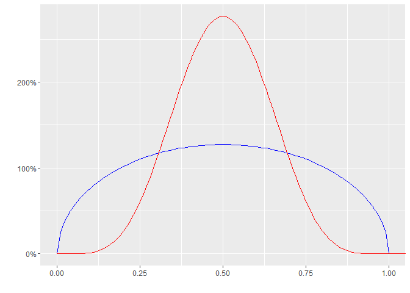

# Doing Bayesian Data Analysis Ch 9: Hierarchical Models

## Exercise 9.1

> Exercise 9.1. [Purpose: Try different priors on K to explore the role of K in 
shrinkage.] Consider the analysis of the therapeutic touch data in Figure 9.10, 
p. 243. The analysis used a generic gamma distributed prior on K that had a mean
of 1.0 and a standard deviation of 10.0. We assumed that the prior had minimal 
influence on the results; here, we examine the robustness of the posterior when 
we change the prior to other reasonably vague and noncommittal distributions. In
particular, we will examine a gamma distributed prior on K that had a mode of 
1.0 and a standard deviation of 10.0. 


```r
library(dplyr)
```

```
## 
## Attaching package: 'dplyr'
```

```
## The following objects are masked from 'package:stats':
## 
##     filter, lag
```

```
## The following objects are masked from 'package:base':
## 
##     intersect, setdiff, setequal, union
```

```r
library(tidyr)

path <- "../DBDA2Eprograms"

touch <- read.csv(file.path(path, "TherapeuticTouchData.csv"))

head(touch)
```

```
##   y   s
## 1 1 S01
## 2 0 S01
## 3 0 S01
## 4 0 S01
## 5 0 S01
## 6 0 S01
```

```r
table(touch$s)
```

```
## 
## S01 S02 S03 S04 S05 S06 S07 S08 S09 S10 S11 S12 S13 S14 S15 S16 S17 S18 
##  10  10  10  10  10  10  10  10  10  10  10  10  10  10  10  10  10  10 
## S19 S20 S21 S22 S23 S24 S25 S26 S27 S28 
##  10  10  10  10  10  10  10  10  10  10
```

```r
touch_agg <- touch %>% 
  group_by(s) %>% 
  summarize(n = n(), 
            y = sum(y))

touch_agg
```

```
## Source: local data frame [28 x 3]
## 
##         s     n     y
##    (fctr) (int) (int)
## 1     S01    10     1
## 2     S02    10     2
## 3     S03    10     3
## 4     S04    10     3
## 5     S05    10     3
## 6     S06    10     3
## 7     S07    10     3
## 8     S08    10     3
## 9     S09    10     3
## 10    S10    10     3
## ..    ...   ...   ...
```


```r
stan_data <- list(y = touch_agg$y, 
                  trials = touch_agg$n, 
                  N = nrow(touch_agg))
```

> (A) What are the shape and rate parameters for a gamma distribution that has 
mean of 1.0 and standard deviation of 10.0? What are the shape and rate 
parameters for a gamma distribution that has mode of 1.0 and standard deviation 
of 10.0? Hint: use the utility functions gammaShRaFromMeanSD and gammaShRaFrom 
ModeSD.

> (B) Plot the two gamma distributions, superimposed, to see which values of K 
they emphasize. The result is shown in Figure 9.18. Relative to each other, 
which gamma distribution favors values of K between about 0.1 and 75? Which 
gamma distribution favors values of K that are tiny or greater than 75? 


```r
library(ggfortify)
```

```
## Loading required package: proto
```

```
## Loading required package: ggplot2
```

```r
# mean 1, sd 10
p <- ggdistribution(dgamma, 
                    seq(0, 100, 0.01), 
                    shape = 0.01, 
                    rate = 0.01, 
                    colour = 'blue')

# mode 1, sd 10
p <- ggdistribution(dgamma, 
               seq(0, 100, 0.01), 
               shape = 1.105125, 
               rate = 0.1051249, 
               colour = 'red', 
               p = p)

p + coord_cartesian(ylim = c(0, 0.1))
```



```r
p + coord_cartesian(ylim = c(0, 0.001))
```



> (C) In the program Jags-Ydich-XnomSsubj-MbinomBetaOmegaKappa.R, find the line 
in the model specification for the prior on kappaMinusTwo. Run the program once 
using a gamma with mean of 1.0, and run the program a second time using a gamma 
with a mode of 1.0. Show the graphs of the posterior distribution. Hints: in the
model specification, just comment out one or the other of the lines: 
#kappaMinusTwo ~ dgamma( 0.01 , 0.01 ) # mean=1 , sd=10 (generic vague) 
kappaMinusTwo ~ dgamma( 1.105125 , 0.1051249 ) # mode=1 , sd=10 
Be sure to save the program before calling it from the script! 
In the script, you might want to change the file name root that is used for 
saved graph files.

This Stan code results in a lot of thrown exceptions for invalid proposals 
given the constraints on the variables.


```r
library(rstan)
```

```
## rstan (Version 2.9.0-3, packaged: 2016-02-11 15:54:41 UTC, GitRev: 05c3d0058b6a)
```

```
## For execution on a local, multicore CPU with excess RAM we recommend calling
## rstan_options(auto_write = TRUE)
## options(mc.cores = parallel::detectCores())
```

```
## 
## Attaching package: 'rstan'
```

```
## The following object is masked from 'package:tidyr':
## 
##     extract
```

```r
model_code <- "
data {
  int<lower=0> N;
  int<lower=0> y[N];
  int<lower=0> trials[N];
}
parameters {
  real omega;
  real kappaMinusTwo;
  vector<lower=0, upper=1>[N] theta;
}
transformed parameters {
  real kappa;
  kappa <- kappaMinusTwo + 2;
}
model {
  omega ~ beta(1, 1);
  kappaMinusTwo ~ %s;
  theta ~ beta(omega*(kappa-2)+1, (1-omega)*(kappa-2)+1);
  y ~ binomial(trials, theta);
}
"

mean_1_code <- sprintf(model_code, "gamma(0.01, 0.01)")
mode_1_code <- sprintf(model_code, "gamma(1.105125, 0.1051249)")

mean_1_fit <- stan(model_code = mean_1_code, data = stan_data)
mode_1_fit <- stan(model_code = mode_1_code, data = stan_data)
```

> (D) Does the posterior distribution change much when the prior is changed? In 
particular, for which prior does the marginal posterior distribution on K have a
bigger large-value tail? When K is larger, what effect does that have on 
shrinkage of the thetas values? 


```r
mean_1_kappa <- rstan::extract(mean_1_fit)$kappa
mode_1_kappa <- rstan::extract(mode_1_fit)$kappa

ggplot() + 
  geom_density(aes(mean_1_kappa), fill = "blue", alpha = 0.5) + 
  geom_density(aes(mode_1_kappa), fill = "red", alpha = 0.5) + 
  xlab("kappa posterior")
```



```r
mean_1_theta <- rstan::extract(mean_1_fit)$theta
mode_1_theta <- rstan::extract(mode_1_fit)$theta

ggplot() + 
  geom_violin(aes(subject, theta), 
              data = gather(as.data.frame(mean_1_theta), subject, theta), 
              fill = "blue", alpha = 0.5) + 
  geom_violin(aes(subject, theta), 
              data = gather(as.data.frame(mode_1_theta), subject, theta), 
              fill = "red", alpha = 0.5)
```



```r
touch_est <- touch_agg %>% 
  mutate(rate = y / n, 
         mean_1_theta = colMeans(mean_1_theta), 
         mode_1_theta = colMeans(mode_1_theta))

ggplot(touch_est) + 
  geom_segment(aes(x = rate, xend = mean_1_theta, y = 0.25, yend = 0.75), 
               arrow = arrow(length = unit(0.1, "cm")), color = "blue") + 
  geom_segment(aes(x = rate, xend = mode_1_theta, y = 0.25, yend = 0.75), 
               arrow = arrow(length = unit(0.1, "cm")), color = "red") + 
  ylim(0, 1)
```



> (E) Which prior do you think is more appropriate? To properly answer this 
question, you should do the next exercise! 


---

## Exercise 9.2

> Exercise 9.2. [Purpose: Examine the prior on thetas implied by the prior 
constants at higher levels.] To sample from the prior in JAGS, we just comment 
out the data, as was explained in Section 8.5. In the program Jags-Ydich-XnomSsubjMbinomBetaOmegaKappa.R, just comment out the line that 
specifies z, like this:
dataList = list( # z = z , N=N, Nsubj = Nsubj )
Save the program, and run it with the two priors on K discussed in the previous 
exercise. You may want to change the file name root for the saved graphics
files. For both priors, include the graphs of the prior distributions on thetas and 
the differences of thetas's such as theta[1]-theta[28]. See Figure 9.19. 


```r
no_data_model_code <- "
data {
  int<lower=0> N;
  int<lower=0> y[N];
  int<lower=0> trials[N];
}
parameters {
  real omega;
  real kappaMinusTwo;
  vector<lower=0, upper=1>[N] theta;
}
transformed parameters {
  real kappa;
  kappa <- kappaMinusTwo + 2;
}
model {
  omega ~ beta(1, 1);
  kappaMinusTwo ~ %s;
  theta ~ beta(omega*(kappa-2)+1, (1-omega)*(kappa-2)+1);
//  y ~ binomial(trials, theta);
}
"

mean_1_no_data_code <- sprintf(no_data_model_code, "gamma(0.01, 0.01)")
mode_1_no_data_code <- sprintf(no_data_model_code, "gamma(1.105125, 0.1051249)")

mean_1_no_data_fit <- stan(model_code = mean_1_no_data_code, 
                           data = stan_data, algorithm = "NUTS")
mode_1_no_data_fit <- stan(model_code = mode_1_no_data_code, 
                           data = stan_data, algorithm = "NUTS")
```


```r
# this doesn't really seem to work with Stan
mean_1_theta_prior <- as.numeric(extract(mean_1_no_data_fit)$theta)
mode_1_theta_prior <- as.numeric(extract(mode_1_no_data_fit)$theta)

ggplot() + 
  geom_density(aes(mean_1_theta_prior), fill = "blue", alpha = 0.5) + 
  geom_density(aes(mode_1_theta_prior), fill = "red", alpha = 0.5)
```



```r
# try plotting the prior for theta directly, using the means of the prior distributions
# mean 1, sd 10
omega <- 1 / (1 + 1)
kappa <- 0.01 / 0.01 + 2
p <- ggdistribution(dbeta, 
                    seq(0, 1, 0.01), 
                    shape1 = omega*(kappa-2)+1, 
                    shape2 = (1-omega)*(kappa-2)+1, 
                    colour = 'blue')

# mode 1, sd 10
omega <- 1 / (1 + 1)
kappa <- 1.105125 / 0.1051249 + 2
p <- ggdistribution(dbeta, 
                    seq(0, 100, 0.01), 
                    shape1 = omega*(kappa-2)+1, 
                    shape2 = (1-omega)*(kappa-2)+1, 
                    colour = 'red', 
                    p = p)

p + coord_cartesian(xlim = c(0, 1))
```



> (A) Explain why the implied prior distribution on individual thetas has rounded 
shoulders (instead of being essentially uniform) when using a prior on K that 
has a mode of 1 (instead of a mean of 1). 

> (B) Which prior do you think is more appropriate? 

> Exercise 9.3. [Purpose: Compare Bayesian shrinkage with MLE shrinkage] 
Construct a data set like the data in Figure 9.12 and do a Bayesian analysis 
like that done for the therapeutic touch data. Compare the Bayesian parameter 
estimates with the MLE estimates(gleaned from Figure 9.12).What does the 
Bayesian analysis provide that is not provided by the MLE? 

Did not do.

> Exercise 9.4. [Purpose: Explore duration of processing by JAGS] Consider the 
therapeutic touch data of Figure 9.9, as analyzed by the programJags-YdichXnomSsubj-MbinomBetaOmegaKappa.R. Open that program in RStudio and find the section that calls runjags or rjags. (A) Set the program (if it is not already) to use three parallel chains with runjags. Be sure to save the program after any changes. Then run the high-level script, JagsYdich-XnomSsubj-MbinomBetaOmegaKappa-Example.R. Be sure it hasproc.time() before and after genMCMC so that you can monitor how long it takes to generate the MCMC chain. Report the elapsed time of the chain generation, and also include the chain-diagnostic graph of omega, which includes its ESS.
264 DoingBayesianDataAnalysis
(B) Set the program Jags-Ydich-XnomSsubj-MbinomBetaOmegaKappa.R to use rjags (with a single long chain). Be sure to save the program after any changes. Then run the high-level script, Jags-Ydich-XnomSsubj-Mbinom BetaOmega Kappa-Example.R. Be sure it has proc.time() before and after genMCMC so that you can monitorhow long it takes to generate the MCMC chain. Report the elapsed time of the chain generation, and also include the chain-diagnostic graph of omega, which includes its ESS. (C) Compare the two runs. What is the difference in run durations? Are the ESSs about the same?

Did not do.
